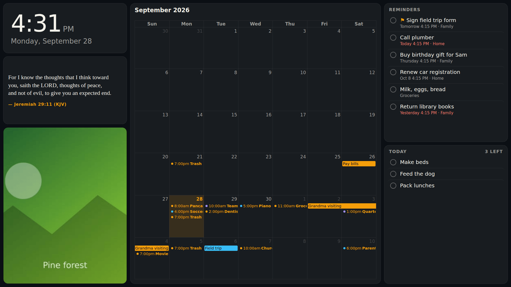
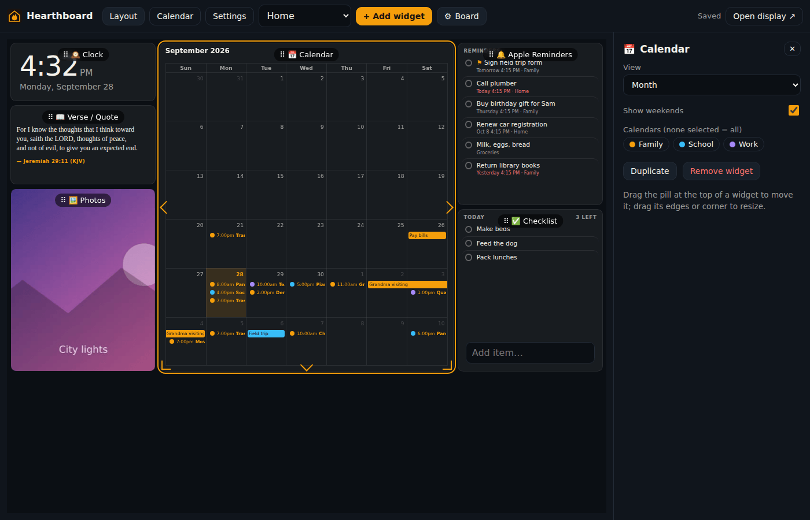
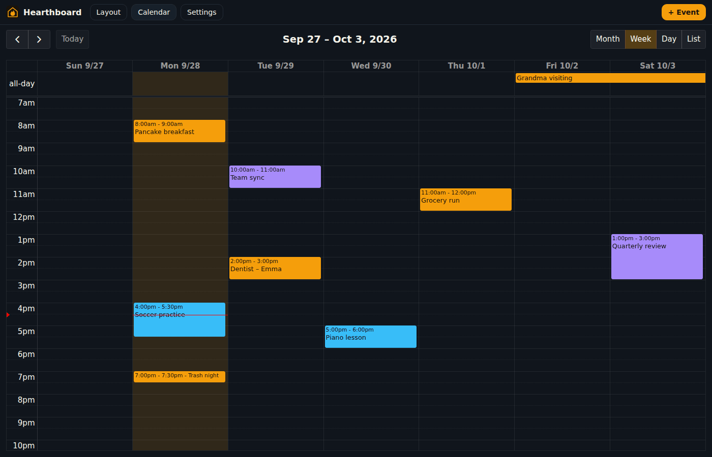
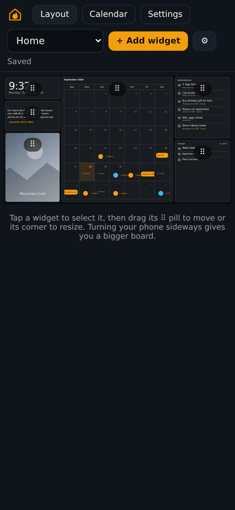

# Hearthboard

A drag-and-drop family wall calendar for your home network. It runs in
Docker on a Synology NAS (or any Docker host). Hang a TV or monitor in the
kitchen and point its browser at the board, then arrange everything from your
phone or PC.



## What it does

- **Two-way Apple (iCloud) and Google Calendar.** Your calendars appear
  together. Anything you add, drag, resize or edit on the board is saved back
  to the calendar it belongs to, and changes made on your phone show up within
  a minute. Repeating events work the way you'd expect ("only this one" or
  "all events").
- **Apple Reminders**, sent by a small iPhone Shortcut (Apple doesn't let
  servers read iCloud Reminders). Tick one off on the board and the Shortcut
  completes it on your phone.
- **Photos from Synology Photos:** a slideshow from your photo library, or
  from one album. iPhone HEIC photos use the previews Synology already made.
- **Bible verse or quote of the day:** a built-in list of King James Version
  verses (public domain) plus quotes, or your own entries.
- **Checklists:** chores, groceries, packing lists. Optionally untick
  everything at midnight.
- **A clock.**
- **Everything moves and resizes.** Drag widgets around a grid, stretch them
  to any size, and make several boards (kitchen, kids' room, portrait tablet).
  The TV updates the moment you let go.
- **A sign-in for each person, with two-step sign-in.** Everyone in the family
  gets their own username, password and boards. Codes from an authenticator app
  can be required on top of the password.
- **Made for a wall:** seven color themes, five text sizes (per board or per widget), optional night dimming, burn-in
  protection, reconnects by itself, and reloads nightly to pick up updates.

| Layout editor (PC)                | Calendar page                         | Editor on a phone                             |
| --------------------------------- | ------------------------------------- | --------------------------------------------- |
|  |  |  |

## Install on a Synology NAS

The short version: in **Container Manager → Project → Create**, paste
[`docker-compose.yml`](docker-compose.yml), then set your time zone, your
`PUID`/`PGID` and the path to your photos. Then open
`http://<nas-ip>:8080/edit`.

The step-by-step guide, including how to find your user ID and how to put the
board on a Fire TV, Raspberry Pi or iPad, is in
**[docs/synology-install.md](docs/synology-install.md)**.

Then connect your accounts:

- [Apple iCloud Calendar](docs/icloud-setup.md): an app-specific password,
  2 minutes
- [Google Calendar](docs/google-setup.md): your own free OAuth client,
  about 10 minutes, once
- [Apple Reminders](docs/reminders-shortcut.md): an iPhone Shortcut and an
  automation, about 5 minutes

To try it with sample data first, add `HEARTHBOARD_DEMO: "1"` to the
environment.

## Pages

| URL         | What it's for                                                                                             |
| ----------- | --------------------------------------------------------------------------------------------------------- |
| `/`         | The wall display. Read-only, no login. `/?board=<id>` shows another board.                                |
| `/edit`     | Arrange widgets: drag the ⠿ pill to move, drag edges to resize, ⚙︎ for board settings.                     |
| `/calendar` | Full calendar: drag to move, stretch to resize, select a time range to create, click to edit or delete.   |
| `/settings` | Your account and two-step sign-in, people, calendars, the reminders Shortcut, photos, checklists, verses. |

Anyone on your network can look at a board: TVs don't sign in. Changing
anything needs a sign-in.

## People and sign-in

The first visit to `/edit` creates your sign-in, and you become the **admin**.
Add everyone else under **Settings → People**. Each person gets:

- **Their own username and password.** Passwords are at least 8 characters.
- **Their own board**, named after them, which they can rearrange and copy.
  Show it on a screen with `/?board=<id>` (Board settings shows the address).
  Members see and edit only their own boards; admins see everyone's, can help
  arrange them, and can hand a board to someone else ("Belongs to" in Board
  settings).
- **A role.** _Members_ can arrange their boards, edit the calendar, tick
  reminders and manage checklists and verses. _Admins_ can also add and remove
  people, connect calendar accounts and Synology Photos, and see the reminders
  token.

Calendars, reminders, photos and checklists are shared by the household. To
give someone a board with just their calendar, pick it under the calendar
widget's settings.

### Two-step sign-in

Under **Settings → My account → Two-step sign-in**, scan the QR code with an
authenticator app: the iPhone's Passwords app, Google Authenticator, Microsoft
Authenticator, 1Password and others all work. From then on, signing in asks for
the app's 6-digit code after the password.

- You get 10 **recovery codes** when you turn it on. Each one signs you in once
  if you lose your phone. Save them somewhere safe.
- An admin can require it for everyone (**Settings → People**). Anyone signed in
  without it is signed out, and sets it up the next time they sign in.
- If someone loses their phone and their recovery codes, an admin can turn their
  two-step sign-in off (**People → Edit**) so they can set it up again.
- **Locked out as the only admin?** Set `HEARTHBOARD_ADMIN_PASSWORD` to a new
  password and `HEARTHBOARD_RESET_ADMIN: "1"` in the container's environment,
  then restart it. The `admin` user gets that password with two-step sign-in
  off. Then remove `HEARTHBOARD_RESET_ADMIN` again.

### Upgrading from the admin PIN

Earlier versions had a single admin PIN. After upgrading, sign in with the
username **`admin`** and your old PIN as the password; that user owns all your
existing boards. Then change the password (**Settings → My account**), rename
yourself if you like (**Settings → People → Edit**), and add the rest of the
family. Every device is signed
out once by the upgrade. TVs showing the board aren't affected.

## Configuration

All settings are environment variables. The defaults suit the Docker image.

| Variable                     | Default         | Meaning                                                                                                                                           |
| ---------------------------- | --------------- | ------------------------------------------------------------------------------------------------------------------------------------------------- |
| `TZ`                         | `UTC`           | Your time zone, e.g. `America/Chicago`. Decides "today" and all-day events.                                                                       |
| `PUID` / `PGID`              | `1000` / `1000` | User and group the server runs as (Synology: usually `1026` / `100`).                                                                             |
| `PORT`                       | `8080`          | HTTP port.                                                                                                                                        |
| `HEARTHBOARD_DATA`           | `/data`         | Database, encryption key and image cache.                                                                                                         |
| `HEARTHBOARD_PHOTOS`         | `/photos`       | Photo folder (mount it read-only).                                                                                                                |
| `HEARTHBOARD_SYNC_INTERVAL`  | `60`            | Seconds between calendar syncs (minimum 15).                                                                                                      |
| `HEARTHBOARD_ADMIN_PASSWORD` | (none)          | On first start, create an `admin` user with this password instead of setup on first visit. `HEARTHBOARD_PIN` is the older name and still works.   |
| `HEARTHBOARD_RESET_ADMIN`    | (off)           | `1` resets the `admin` user to `HEARTHBOARD_ADMIN_PASSWORD` with two-step sign-in off, on every start. For getting back in; remove it afterwards. |
| `HEARTHBOARD_SECRET`         | (generated)     | Key for encrypting stored credentials. By default one is generated in `/data/secret.key`.                                                         |
| `HEARTHBOARD_PUBLIC_URL`     | (none)          | HTTPS address of the board, if you have one. Lets Google sign-in redirect back directly.                                                          |
| `HEARTHBOARD_DEMO`           | (off)           | `1` loads sample calendars, reminders and photos.                                                                                                 |

## Themes and text sizes

Pick a theme and a text size under **Layout → Board**. Each widget can also
override the text size in its own settings.

Themes: Ember (dark, the default), Linen (light), Midnight, Forest, Sunrise,
Slate and High contrast. Text sizes: Extra small, Small, Medium, Large, Extra
large.

All of them live in [`shared/src/themes.ts`](shared/src/themes.ts). To change a
theme, edit its colors there. To add one, copy an entry and give it a new key;
it shows up in Board settings and is accepted by the API with no other changes.
Text sizes work the same way (`scale: 1` is the original size). Boards that
point at a theme or size you later remove fall back to the defaults.

## How it works

```
 iPhone Shortcut ──POST reminders──┐
                                   ▼
 iCloud (CalDAV) ◀──two-way──▶  ┌──────────────────────────┐ ◀──WebSocket── TV / tablet  (/)
 Google Calendar ◀──two-way──▶  │  Hearthboard (Node.js)   │ ◀──HTTP─────── phone / PC   (/edit, /calendar, /settings)
 Synology Photos ──read-only──▶ │  SQLite in /data         │
 /photos (ro mount) ──────────▶ └──────────────────────────┘
```

- **Server:** Fastify and SQLite (`better-sqlite3`), written in TypeScript.
  Calendars are polled into a local cache, so the board stays fast and keeps
  working if the internet drops. Writes go straight to iCloud or Google with
  ETag checks, so a change made on a phone is never silently overwritten.
  Every change is pushed to open screens over a WebSocket.
- **Calendars:**
  - iCloud and other CalDAV servers use `tsdav` and `ical.js`: recurring
    events, exceptions and time zones are expanded and edited in iCalendar
    itself.
  - Google uses the Calendar API with incremental sync tokens.
- **Web:** React, [react-grid-layout](https://github.com/react-grid-layout/react-grid-layout)
  for the board and [FullCalendar](https://fullcalendar.io/) (MIT plugins)
  for the calendar. A board is designed for one resolution (e.g. 1920×1080)
  and scaled to fit whatever screen shows it.
- **Security:**
  - Passwords and tokens are encrypted at rest (AES-256-GCM).
  - Passwords are hashed with scrypt, and sign-in attempts are rate-limited.
  - Two-step sign-in uses standard TOTP (RFC 6238) codes, each accepted once.
    Authenticator secrets are encrypted at rest, and recovery codes are stored
    hashed.
  - Sessions are stored hashed. Changing a password or turning on two-step
    sign-in signs out your other devices.
  - The reminders endpoint uses its own token.
  - The container runs as your user, and the photo mount is read-only.

Adding a new widget type takes one component in `web/src/widgets/`, one entry
in `web/src/widgets/registry.tsx`, and a config schema in
`shared/src/widgets.ts`.

## Development

Requires Node 22.

```sh
npm install
npm run dev:demo        # server on :8080 with sample data, Vite on :5173
```

Open <http://localhost:5173/edit>. Other scripts:

```sh
npm test                # unit + API tests (pip install radicale to include the CalDAV integration tests)
npm run build           # web + server bundle, then: npm start
npm run test:e2e        # Playwright end-to-end tests (after npm run build)
npm run lint && npm run typecheck && npm run format:check
docker build -t hearthboard .
```

Repository layout: `shared/` (types and schemas used by both sides),
`server/` (API, sync, providers), `web/` (the React app), `e2e/`
(Playwright) and `docs/` (setup guides).

## Limitations

- **Apple Reminders:** they only update when the iPhone Shortcut runs, and
  the phone must be on your home network (or a VPN) to reach the NAS.
- **Calendar range:** the board caches from about 3 months back to about 13
  months ahead.
- **Subscribed calendars:** iCloud _subscribed_ calendars (holiday and sports
  feeds) aren't available over CalDAV.
- **Photos:** HEIC photos show only once Synology Photos has generated their
  previews. The Synology Photos album mode needs a DSM account without 2-factor
  sign-in.

## License

[MIT](LICENSE)
