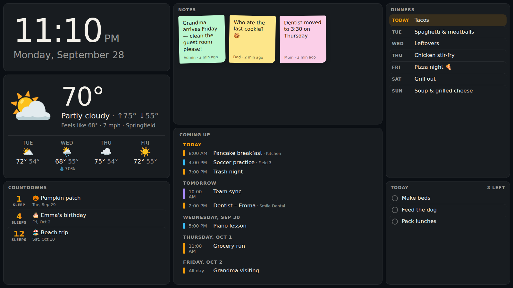
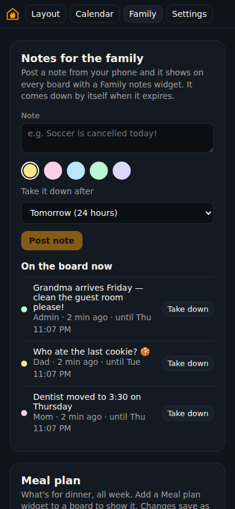
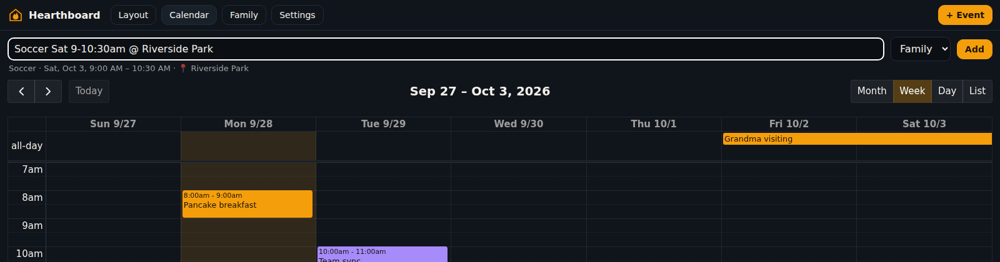
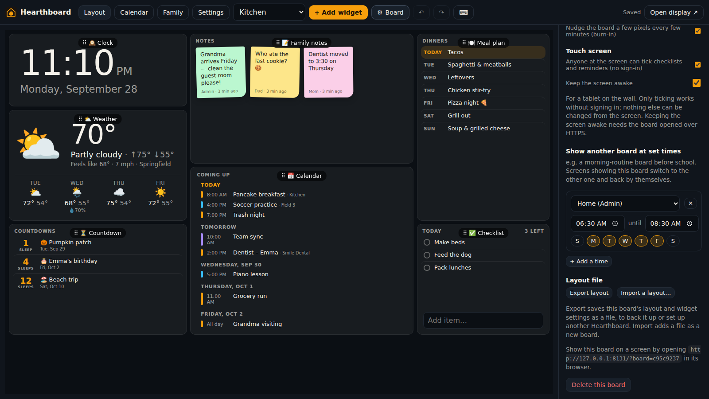

# Feature guide

This guide covers the newer features, one section each: what it does, how to turn it on, and
what to know. For installing and connecting accounts, see the [README](../README.md) and the
other guides in this folder.

| #   | Feature                                                         | Where you find it                                  |
| --- | --------------------------------------------------------------- | -------------------------------------------------- |
| 1   | [Weather widget](#1-weather-widget)                             | Layout → + Add widget → Weather                    |
| 2   | [Countdown widget](#2-countdown-widget)                         | Layout → + Add widget → Countdown                  |
| 3   | [Meal plan](#3-meal-plan)                                       | **Family** page, and the Meal plan widget          |
| 4   | [Family notes](#4-family-notes)                                 | **Family** page, and the Family notes widget       |
| 5   | [Subscribed calendars (.ics / webcal)](#5-subscribed-calendars) | Settings → Calendars → Subscribe to a calendar     |
| 6   | [Quick add in plain words](#6-quick-add-in-plain-words)         | The box at the top of the **Calendar** page        |
| 7   | [Undo, redo and keyboard shortcuts](#7-undo-redo-and-shortcuts) | **Layout** page: ↶ ↷ buttons, or press `?`         |
| 8   | [Touch-screen mode](#8-touch-screen-mode-for-a-wall-tablet)     | Layout → ⚙︎ Board → Touch screen                    |
| 9   | [Board schedules](#9-board-schedules)                           | Layout → ⚙︎ Board → Show another board at set times |
| 10  | [Export and import layouts](#10-export-and-import-layouts)      | Layout → ⚙︎ Board → Layout file                     |

---

## 1. Weather widget

Current conditions and a forecast for up to 7 days: temperature, "feels like", wind, the day's
high and low, and the chance of rain when it's 30% or more.



**Set it up**

1. On the **Layout** page, choose **+ Add widget → Weather**.
2. In the widget's settings, type your town under **Place** and press **Search**, then pick the
   right one from the list. On a phone or PC opened over HTTPS you can also press
   **📍 Use this device's location**.
3. Pick the **Units** and how many **Days of forecast** to show (0 shows just today).

**Good to know**

- The forecast comes from [Open-Meteo](https://open-meteo.com): free, no account or API key.
  The NAS needs to reach the internet, the same as it does for calendars.
- The server fetches each place at most every 15 minutes and shares the result with every
  screen, so ten TVs don't mean ten requests.
- **Units → Automatic** shows °F and mph when the screen's browser is set to a US English
  locale (and a few other places that use Fahrenheit), otherwise °C and km/h.
- If the internet drops, the widget keeps showing the last forecast for up to 12 hours with a
  small ⚠ beside the temperature.
- The forecast row hides itself when the widget is too short to read it. Make the widget taller
  to see it again.
- In demo mode (`HEARTHBOARD_DEMO=1`) the weather is made up, so the widget works offline.

---

## 2. Countdown widget

"12 days until the beach." "3 sleeps until Christmas." It counts whole days to the dates you
choose, soonest first, and celebrates with 🎉 on the day.

**Set it up**

1. **+ Add widget → Countdown**.
2. Under **Dates**, press **+ Add a date** and fill in an emoji (optional), what it is and the
   date.
3. Tick **Every year** for birthdays, anniversaries and holidays. It then counts to the next
   one, and a February 29 birthday lands on February 28 in other years.
4. **Count in: Sleeps** is for the kids ("1 sleep", "4 sleeps").

**Count down to calendar events automatically**

Put a keyword under **Also count down to calendar events whose title contains**, for example
`🎉` or `#countdown`. Any event in the next year whose title contains it appears on the widget,
with the keyword taken out. Add "Disney trip 🎉" to your iPhone calendar and it shows up on the
board without anyone opening the Layout page. A repeating event counts only once, to its next
occurrence.

**Good to know**

- One-off dates disappear the day after they pass. Yearly ones roll over to next year.
- **Show at most** limits how many countdowns are listed.

---

## 3. Meal plan

Plan the week's meals on your phone and show them on the board.



**Plan meals**

1. Open the **Family** page (top bar). Under **Meal plan** you see this week, Sunday to
   Saturday.
2. Type into a day's box. It saves when you leave the box or press Enter; a green ✓ confirms it.
   Clear a box to remove that meal.
3. Tick **Breakfast & lunch too** to plan more than dinner.
4. Use ‹ and › to plan ahead. **Fill empty days from last week** copies last week's meals into
   the empty days of the week you're looking at, which is handy for a weekly routine.

**Show it on a board**

**+ Add widget → Meal plan**. In its settings choose which **Meals** to show, how many **Days**,
and whether it starts **today** (a rolling list) or at **the start of the week**. Today is
highlighted, and past days in the week view are faded.

Every signed-in family member can edit the plan. Changes appear on screens straight away.

---

## 4. Family notes

Sticky notes for the family, posted from a phone: "Soccer's cancelled today!", "Who ate the last
cookie?". They come down by themselves when they expire.

**Post a note**

1. Open the **Family** page.
2. Write the note (up to 280 characters), pick a color, and choose when to **Take it down
   after**: 4 hours, 24 hours, 3 days, a week, or **Keep it up**.
3. **Post note**. It appears on every board with a **Family notes** widget within a second.

**Show notes on a board**

**+ Add widget → Family notes**. Choose **Sticky notes** (colored notes in a grid) or **A simple
list**, and how many to show. The newest note comes first, signed with who posted it and when.

**Good to know**

- Whoever posted a note, or an admin, can take it down early (**Take down** on the Family page).
- Expired notes leave open screens within a minute, with no reload needed.

---

## 5. Subscribed calendars

Add any calendar that has an **.ics** or **webcal://** address: public holidays, a school's
calendar, a sports team's schedule (TeamSnap, GameChanger and similar), a public iCloud
calendar, or a Google calendar's private "secret address in iCal format". This also covers
iCloud _subscribed_ calendars, which Apple doesn't share over CalDAV.

**Set it up** (admins)

1. **Settings → Calendars → Subscribe to a calendar (holidays, school…)**.
2. Either tap a **Quick pick** (US, UK, Canadian, Australian or Christian holidays) or paste the
   address. `webcal://` addresses work as they are.
3. Optionally give it a name. Otherwise it uses the name the calendar gives itself.
4. **Subscribe**. Its events appear alongside your other calendars. Pick its color, hide it, or
   show it only on certain calendar widgets, the same as any other calendar.

**Where to find the address**

- **School / club websites:** look for "Subscribe", "iCal", "Add to calendar" or "ICS". Copy
  the link instead of downloading the file.
- **Google Calendar:** on a computer, open the calendar's **Settings and sharing → Integrate
  calendar → Secret address in iCal format**.
- **iCloud:** in the Calendar app, share the calendar as a **Public Calendar** and copy the link.

**Good to know**

- Subscribed calendars are **read-only**: events can't be dragged or edited on the board.
- They're checked every 15 minutes (using the server's "not changed" answers when it gives
  them), whatever the sync interval under General. **Sync now** checks straight away.
- Only events within the board's range (about 3 months back to 13 months ahead) are kept, so
  a calendar holding decades of holidays stays small.

---

## 6. Quick add in plain words

On the **Calendar** page, type an event the way you'd say it and press Enter:



```
Soccer Sat 9-10:30am @ Riverside Park
Dinner at Grandma's tomorrow 6pm
Dentist Oct 3 at 2:30
Camp Jul 14-18
Pizza night friday
Book club next thursday at 7 for 2 hours
```

The line under the box shows exactly what will be added before you press **Add**, for example
_Soccer · Sat, Oct 3, 9:00 AM – 10:30 AM · 📍 Riverside Park_. It goes into the calendar shown
next to the box (your last-used one), and the calendar jumps to it.

**What it understands**

| You type                                                           | It means                                                |
| ------------------------------------------------------------------ | ------------------------------------------------------- |
| `today`, `tonight`, `tomorrow`, `day after tomorrow`               | Those days. `tonight` alone means 7 PM.                 |
| `fri`, `friday`, `this friday`                                     | The coming Friday (today, if it's Friday).              |
| `next friday`                                                      | The Friday of the following week.                       |
| `in 3 days`, `in 2 weeks`                                          | Counting from today.                                    |
| `Oct 3`, `October 3rd`, `the 3rd of October`, `10/3`, `2026-10-03` | That date; dates already past this year mean next year. |
| `Jul 14-18`                                                        | An all-day event over those days.                       |
| `7pm`, `7:30 pm`, `19:00`, `at 7`, `noon`, `midnight`              | The start time.                                         |
| `3-4pm`, `9am to 11:30`, `from 3 to 5`, `10pm-1am`                 | Start and end time.                                     |
| `for 2 hours`, `for 30 min`, `for an hour`, `for 3 days`           | How long.                                               |
| `all day`                                                          | An all-day event, even with a time.                     |
| `@ Riverside Park`, `at Grandma's`, `at the park`                  | The location.                                           |

**Rules of thumb**

- No time means an all-day event. No day means today, or tomorrow if that time has passed.
- Hours without am/pm from 1 to 7 ("at 6", "5:30") mean the afternoon or evening; 8 to 11 mean
  the morning. Write `6:30am` or `06:30` for an early start.
- Numeric dates follow your device's language setting: `3/10` is March 10 in the US and
  3 October in the UK.
- "at" starts a location only before a capitalized word or "the", so "Look at photos" stays a
  title.
- Timed events without an end last an hour.

---

## 7. Undo, redo and shortcuts

Every change on the **Layout** page can be undone: moving, resizing, adding and removing
widgets, widget settings and board settings.

- **↶ / ↷** in the top bar undo and redo, which is handy on a phone.
- Removing a widget shows **Widget removed. Undo** at the bottom for a few seconds.
- Quick bursts (typing a title, nudging with arrow keys) undo as one step.
- History is kept per board, up to 60 steps, until you switch boards or reload.

**Keyboard shortcuts** (press `?` on the Layout page to see them)

| Keys                                     | What they do                                           |
| ---------------------------------------- | ------------------------------------------------------ |
| `Ctrl Z` / `⌘ Z`                         | Undo                                                   |
| `Ctrl Shift Z` or `Ctrl Y` / `⌘ Shift Z` | Redo                                                   |
| Arrow keys                               | Move the selected widget one grid square               |
| `Shift` + arrow keys                     | Make the selected widget wider/narrower/taller/shorter |
| `Ctrl D` / `⌘ D`                         | Duplicate the selected widget                          |
| `Delete` or `Backspace`                  | Remove the selected widget                             |
| `Tab` / `Shift Tab`                      | Select the next / previous widget                      |
| `Esc`                                    | Deselect and close panels                              |
| `?`                                      | Show the shortcuts                                     |

Arrow keys won't move a widget off the grid, onto another widget or below its smallest size.
Shortcuts pause while you're typing in a box, and Tab, arrows and Delete only act on widgets
when a toolbar button doesn't have focus.

---

## 8. Touch-screen mode for a wall tablet



The board is read-only on screens by default. TVs don't sign in, so a tap can't change anything.
With touch-screen mode, a tablet on the wall (an iPad, a Fire tablet, a touch monitor) lets
anyone at it **tick off checklist items and reminders** without signing in.

**Turn it on**

1. **Layout → ⚙︎ Board → Touch screen**.
2. Tick **Anyone at the screen can tick checklists and reminders (no sign-in)**.
3. Optionally tick **Keep the screen awake** so the tablet doesn't go to sleep.
4. Open the board on the tablet (`http://<nas>:8080/?board=<id>`, shown at the bottom of Board
   settings).

**What's allowed and what isn't**

- Only ticking and unticking, and only on checklists and reminder lists that board actually
  shows. Adding, renaming or deleting still needs a sign-in, and so do other boards'
  checklists.
- The server checks every tick against the board, so turning the option off takes effect
  immediately.
- Ticking a reminder works the same as on your phone: the iPhone Shortcut completes it on its
  next run.

**Keep awake and full screen**

- **Keep the screen awake** uses the browser's Screen Wake Lock. Browsers only allow it over
  **HTTPS** (for example through DSM's reverse proxy), or on the machine running Hearthboard.
  Over plain HTTP, set the tablet itself to never sleep: on an iPad, **Settings → Display &
  Brightness → Auto-Lock → Never**, and **Guided Access** to lock it to the browser.
- Tap the screen (or move the mouse) on any board and a **⛶ Full screen** button appears for a
  few seconds, in browsers that support it.

---

## 9. Board schedules

Show a different board at set times, then switch back by itself: a morning-routine board with
chores and the weather on school mornings, a dinner board with the meal plan in the evening, or
a calm photo board at night.

**Set it up**

1. Make the boards you want (**+ New board…** in the board list).
2. Open the board your screen normally shows, then **⚙︎ Board → Show another board at set
   times → + Add a time**.
3. Pick the board to show, the times (**from** / **until**) and the days. Days left blank mean
   every day.
4. Add as many times as you like. If two overlap, the first one in the list wins.

Screens showing that board check the schedule every 30 seconds.

**Good to know**

- Times use each screen's own clock. They can pass midnight (`21:00` until `02:00`); such a
  window belongs to the day it starts on, so "Friday 21:00–02:00" still shows at 1 AM Saturday.
- The scheduled board's own settings apply while it's showing (theme, dimming, touch-screen
  mode), but its own schedule is ignored, so schedules don't chain.
- If the scheduled board is deleted, the screen stays on its own board.
- People can only pick boards they can see: their own, or everyone's for an admin.

---

## 10. Export and import layouts

Save a board's layout to a file and load it again, for backups, trying out a new arrangement,
or setting up a second Hearthboard (grandparents' house, the cabin).

- **Export:** **⚙︎ Board → Layout file → Export layout** downloads
  `hearthboard-<board-name>.json` with the board's size, grid, theme, and every widget's
  position and settings.
- **Import:** **⚙︎ Board → Layout file → Import a layout…** and choose the file. It becomes a
  **new board** of yours, and the file is checked first; nothing existing is replaced.

**What carries over, and what doesn't**

- Positions, sizes, themes, text sizes and widget settings carry over.
- Widgets that point at things on the other install keep their setting but may need a fresh
  pick: a checklist widget ("Pick a checklist…"), a calendar widget limited to certain calendars
  (it shows all until you pick again), or a photo album.
- Board schedules are left out, because they point at boards on the install the file came from.

The file is plain JSON:

```json
{
  "hearthboard": 1,
  "exportedAt": "2026-09-29T12:00:00.000Z",
  "board": { "name": "Kitchen", "width": 1920, "height": 1080, "widgets": [ … ] }
}
```

---

## For the curious: new API endpoints

Everything above goes through the same JSON API the web app uses. "Public" means screens can
call it without signing in, like the rest of the display.

| Method and path               | Who             | What                                                             |
| ----------------------------- | --------------- | ---------------------------------------------------------------- |
| `GET /api/weather?lat=&lon=`  | public          | Forecast for a place (cached 15 minutes)                         |
| `GET /api/weather/places?q=`  | signed in       | Look up a place by name                                          |
| `GET /api/meals?start=&days=` | public          | Meals from `start` (YYYY-MM-DD, default today) for `days` (≤ 62) |
| `PUT /api/meals/:date/:slot`  | signed in       | `{ "text": "Tacos" }`; empty text clears it                      |
| `GET /api/notes`              | public          | Current notes, newest first                                      |
| `POST /api/notes`             | signed in       | `{ "text", "color", "expiresInHours" }` (null = keep up)         |
| `DELETE /api/notes/:id`       | author or admin | Take a note down                                                 |
| `POST /api/accounts/ics`      | admin           | `{ "url", "name"? }` subscribe to a calendar feed                |
| `POST /api/boards`            | signed in       | `{ "layout": <exported file> }` imports a layout as a new board  |

Touch-screen boards send an `X-Hearthboard-Board: <board id>` header. The server lets a request
through without a sign-in only when that board has touch-screen mode on, the request only ticks
or unticks (`{ "done": true }`), and the checklist or reminder list is on that board.
